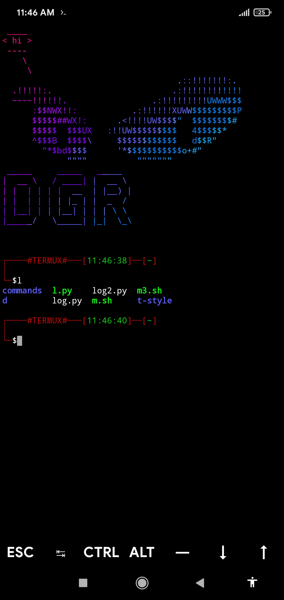
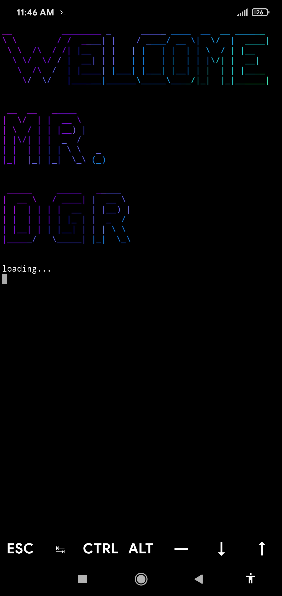

# t-style-v2

Hi all again ,

Here, I am back with a new termux style which is cool , better , and easy to install .

# installation

- git clone https://github.com/dev22419/t-style-v2

- cd t-style-v2

- chmod +x install.sh

- ./install.sh

- cd 

And that's all you have to for styling your termux.

# auto-install (one code)

git clone https://github.com/dev22419/t-style-v2 && cd t-style-v2 && chmod +x install.sh && ./install.sh && cd 

# screenshots

# packages required

- python

- lolcat 

- figlet

- cowsay

- termux-api
# note :

The requirements are already satisfied by my script . My script will install requirements automatically but in case there is an error install it manually .

And if there is any mistake let me know.

And if my script is throughing any error the please held an issue so I can solve it .
